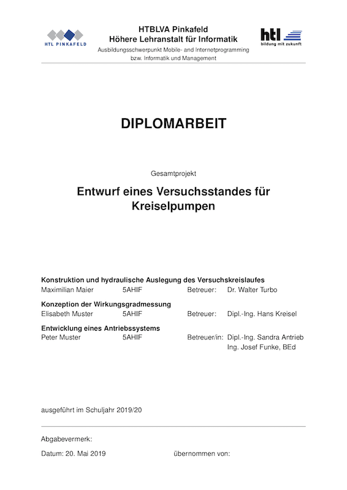

# HTL Pinkafeld Informatik Diplomarbeit

This is a LaTeX template for a diploma thesis at HTL Pinkafeld, department for Informatics. 

It was compiled by Thomas Quaritsch in 2019 based on [Karl Voit's KOMAscript template](https://github.com/novoid/LaTeX-KOMA-template) and [Thomas Quaritsch's longdoc template](https://github.com/tquaritsch/latex-koma-longdoc). 

It's use is not compulsory (use MS Word if you want to :)) and basic understanding of LaTeX is required. Some LaTeX commands to include graphics, references, tables, listings etc. are explained in the template's example content itself. 

This template can be used via [overleaf.com](overleaf.com).

## Demo

[Example.pdf](Example.pdf)

## License

This template is licensed under a [Creative Commons Attribution-ShareAlike 4.0 International (CC BY-SA 4.0) license](https://creativecommons.org/licenses/by-sa/4.0/):

* You can share (to copy, distribute and transmit) this template.
* You can remix (adapt) this template.
* You can make commercial use of the template.
* In case you modify this template and share the derived template: You must attribute the template such that you do not remove (co-)authorship of Thomas Quaritsch, Karl Voit and you must not remove the URL to the original repository on github.
* If you alter, transform, or build a new template upon this template, you may distribute the resulting template only under the same or similar license to this one.
* There are no restrictions of any kind, however, related to the resulting (PDF) document!
